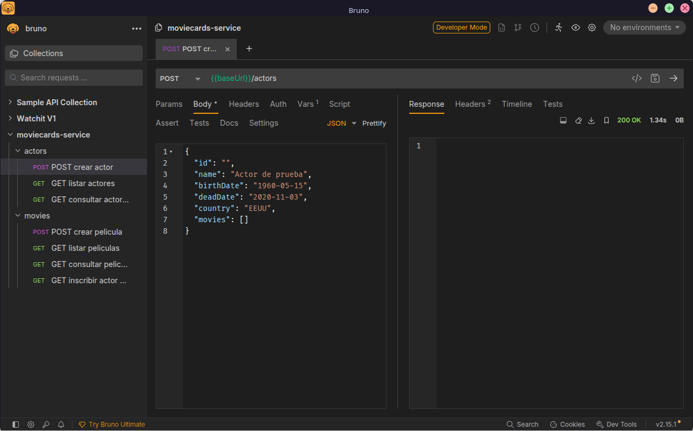
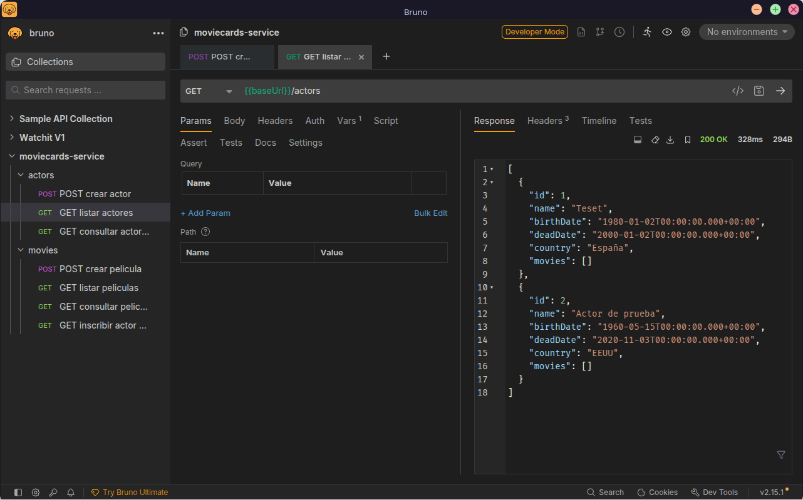
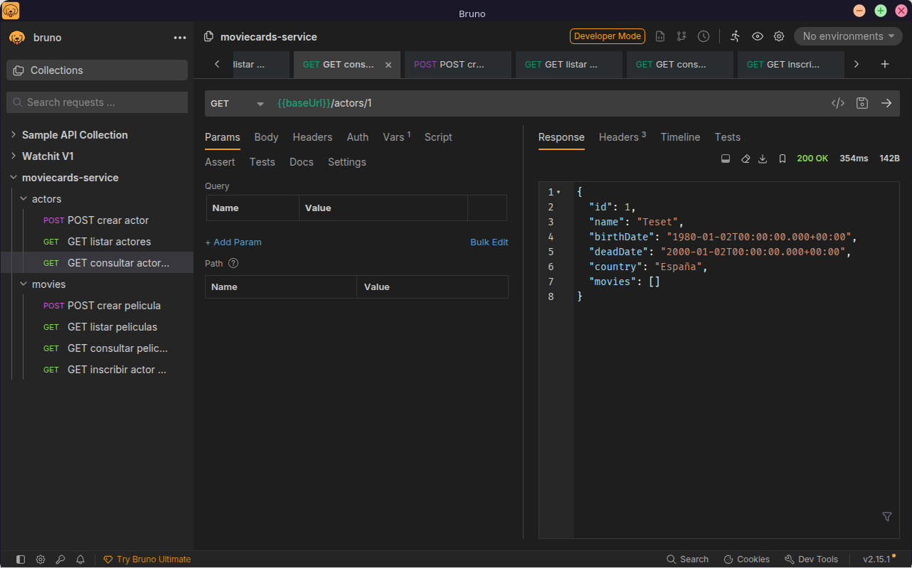
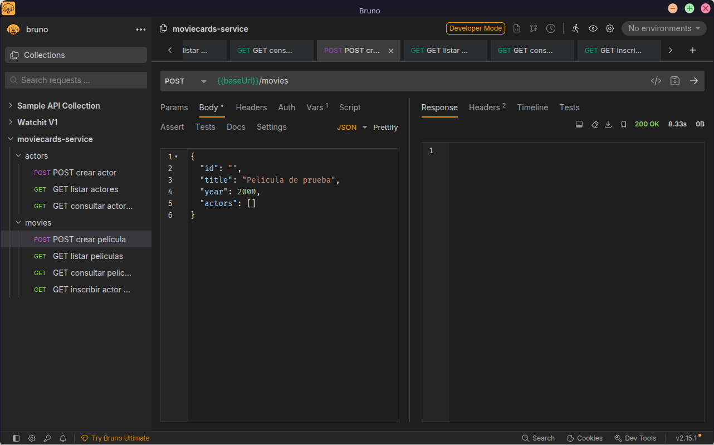
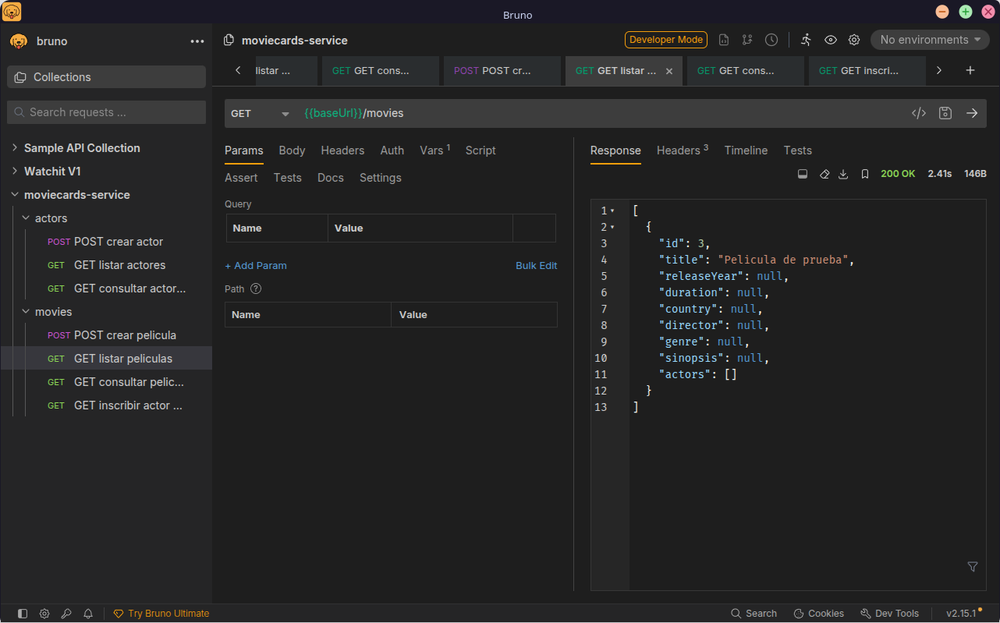
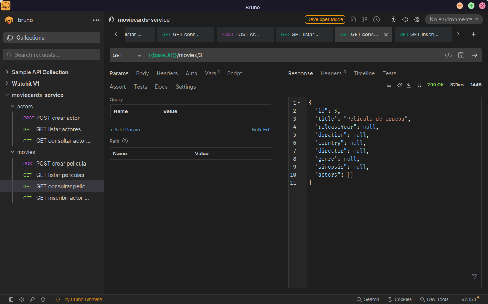
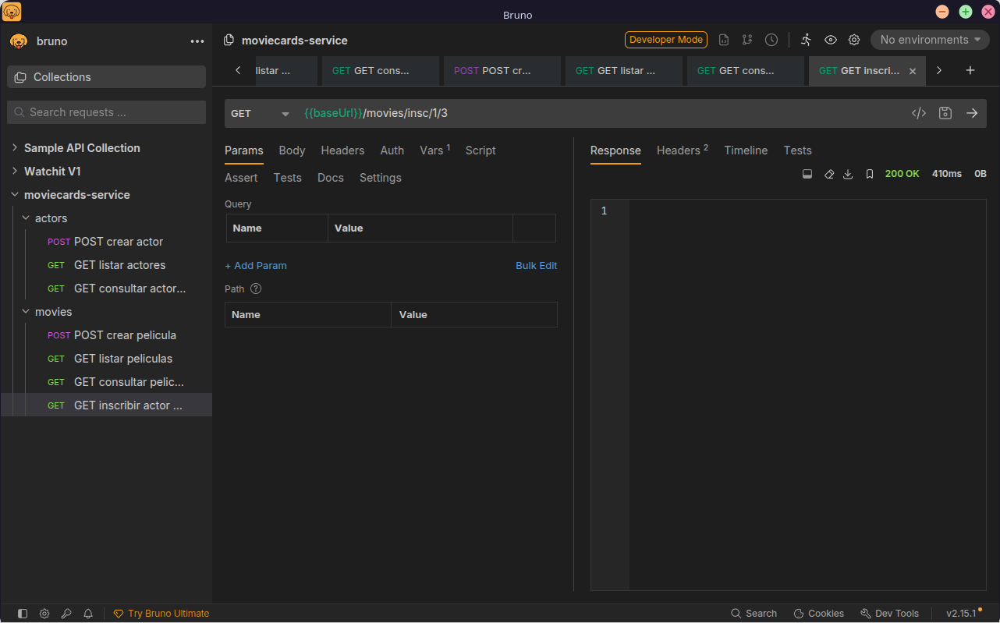
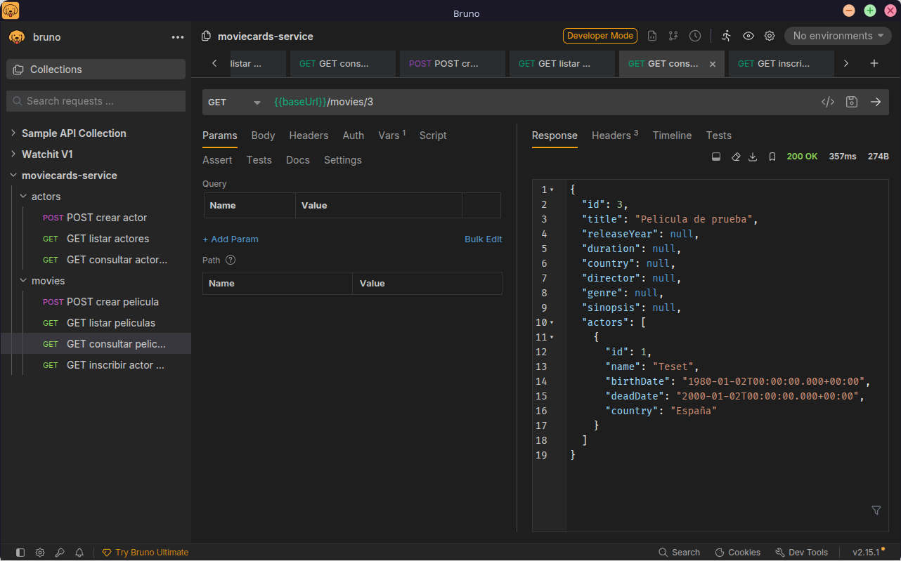

# Documentación — Trabajo Final ICDA
**Servicio en producción:** https://moviecards-service-sandoval.azurewebsites.net

---

## Punto 2 — Creación y despliegue del servicio `moviecards-service`

El servicio se creó reutilizando el código base del profesor disponible en https://github.com/josehilera/moviecards-service. Expone una API REST que gestiona actores y películas y es consumida por la aplicación `moviecard`.

### Pipeline CI/CD [`.github/workflows/main.yaml`](./.github/workflows/main.yaml)

El workflow tiene tres trabajos: `build → test → deploy`.

| Trabajo  | Descripción                                                     |
|----------|-----------------------------------------------------------------|
| `build`  | Compila con Maven y sube el artefacto `moviecards-service-java` |
| `test`   | Ejecuta pruebas unitarias y de integración (`mvn clean verify`) |
| `deploy` | Despliega en Azure App Service `moviecards-service-sandoval`    |

Commits relevantes:

| Commit    | Descripción                                                                                      |
|-----------|--------------------------------------------------------------------------------------------------|
| `38bed31` | *Init project* — código base del servicio                                                        |
| `5f594bc` | Workflow generado automáticamente por Azure                                                      |
| `43e2c24` | *Refactor main.yaml to deploy the app to Azure* — workflow simplificado integrado en `main.yaml` |
| `b0408b1` | *Fix main workflow to run deploy after test* — corrige orden de dependencias                     |

### Endpoints disponibles

Probados con **Bruno** ([colección](./bruno/moviecards-service/)). Todas las peticiones devuelven `200 OK`.

**`POST /actors`**


**`GET /actors`**


**`GET /actors/{id}`**


**`POST /movies`**


**`GET /movies`**


**`GET /movies/{id}`**


**`GET /movies/insc/{idA}/{idM}`** — inscribir actor en película


Película tras inscribir al actor:



---

## Punto 4 — Añadir `deadDate` al modelo `Actor`

Se añadió el campo `deadDate` a la entidad `Actor` para registrar la fecha de fallecimiento. No se crearon ramas, milestones ni issues para este punto.

**Rama:** `add-deadDate` → **PR #1** (merge `d9a7e63`)
**Commit:** `10c4451` — *Add deadDate to Actor and modify tests*

### Cambios en `src/main`

Archivo: `src/main/java/com/lauracercas/moviecards/model/Actor.java`

```java
@DateTimeFormat(pattern = "yyyy-MM-dd")
private Date deadDate;

// getter y setter correspondientes
public Date getDeadDate() { return deadDate; }
public void setDeadDate(Date deadDate) { this.deadDate = deadDate; }
```

### Cambios en `src/test`

Archivos modificados:

| Archivo                                                          | Cambio                                           |
|------------------------------------------------------------------|--------------------------------------------------|
| `src/test/java/.../integrationtest/repositories/ActorJPAIT.java` | Verificación de `deadDate` al persistir un actor |
| `src/test/java/.../unittest/model/ActorTest.java`                | Assert sobre getter/setter de `deadDate`         |

### Verificación con Bruno

Ejemplo de `POST /actors` con `deadDate`:

```json
{
  "id": "",
  "name": "Actor de prueba",
  "birthDate": "1960-05-15",
  "deadDate": "2020-11-03",
  "country": "EEUU",
  "movies": []
}
```

Las capturas del `POST /actors` y del `GET /actors` con `deadDate` están en la sección [Endpoints disponibles](#endpoints-disponibles).
